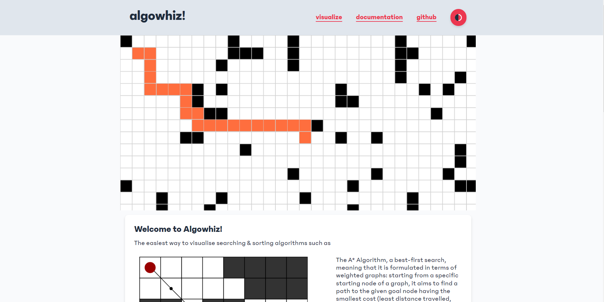
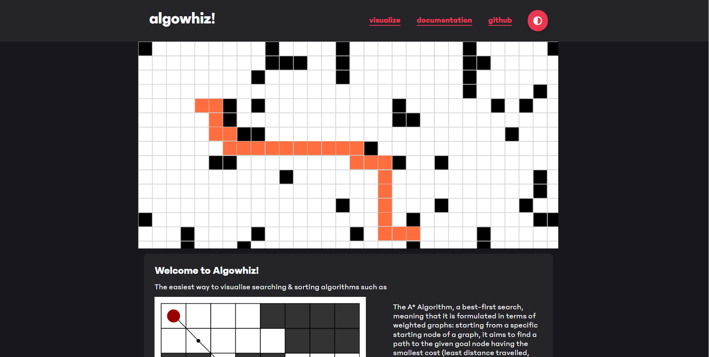

# Algowhiz!




## Overview

Algowhiz is a dynamic algorithm visualizer that allows users to input C++ code, visualize the execution of sorting and pathfinding algorithms, and interact with a responsive, user-friendly interface. The tool is designed for both educational and practical purposes, providing a clear understanding of how different algorithms work through step-by-step visualization.

## Features

- **Code Input**: Input your C++ code directly via the built-in text editor and watch it execute in real-time.
- **Algorithm Visualization**: Visualize the steps of various sorting algorithms (Bubble Sort, Selection Sort, etc.) and pathfinding algorithms (A*, Dijkstra’s) as they process the input data.
- **Interactive Grid**: For pathfinding, interact with a 20x100 grid where you can place start points, end points, and obstacles to see how the algorithms find the shortest path.
- **Dark Mode**: Toggle between light and dark themes to suit your visual preference.
- **Responsive Design**: The user interface is designed to be fully responsive, ensuring a smooth experience on both desktop and mobile devices.

## Project Structure

- **`public/`**: Contains all the frontend assets, including HTML, CSS, JavaScript, and images.
  - `index.html`: The main entry point for the application’s UI.
  - `styles.css`: Contains all the styles used across the application.
  - `script.js`: Contains the JavaScript logic for interacting with the UI and backend.
  - `switch.js`: Handles theme switching between light and dark modes.
- **`server/`**: Contains the backend logic and API routes powered by Node.js.
  - `app.js`: The main server file that handles requests, serves the frontend, and processes algorithms.
- **`.gitignore`**: Specifies files and directories that should be ignored by Git, such as `node_modules`.
- **`README.md`**: This document, providing an overview of the project, how to set it up, and how to use it.

## Setup

To get started with Algowhiz, follow these steps:

1. **Clone the Repository**:
   ```bash
   git clone https://github.com/yourusername/algowhiz.git
   cd algowhiz
2. **Install Dependencies**:
   ```bash
   npm install
3. **Start the Server**:
    ```bash
    node app.js
4. **Access the Website**:
    - Open any Chromium-Based browser (eg. Chrome)
    - Navigate to **http://localhost:3000**
    - Click the **visualize** button

## Usage
- Input C++ Code: Start by typing or pasting your C++ code into the provided text editor.
- Choose an Algorithm: Select a sorting or pathfinding algorithm from the dropdown menu.

- Run the Algorithm: Click the "Run" button to visualize the execution of the chosen algorithm.
- Interact with the Grid: For pathfinding algorithms, you can place start points, end points, and obstacles directly on the grid.
- Toggle Dark Mode: Use the dark mode button to switch between light and dark themes based on your preference.

## Contributing
If you would like to contribute to Algowhiz, please fork the repository and create a pull request with your changes. Contributions that improve the functionality, performance, or documentation are always welcome!